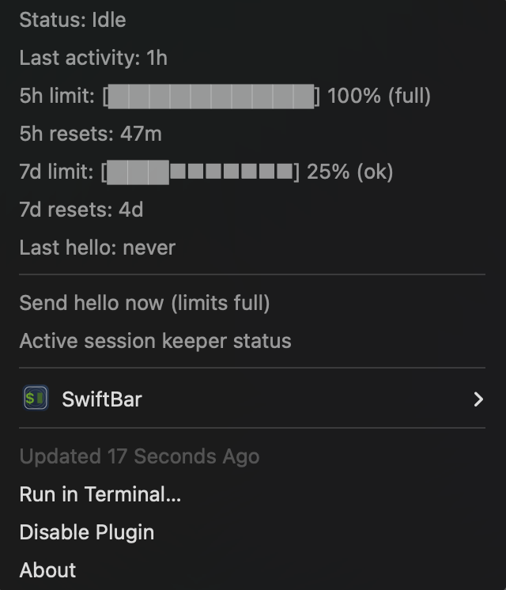

# claude-keepalive-status-toolbar

A lightweight macOS menu bar status (SwiftBar) + keepalive loop for Claude Code.

- **Menu bar**: live activity status, session start, last activity age, rate-limit progress bars, reset times, extra usage on/off, and hello history.
- **Usage history**: local cost rollups (last 3 days + current month) stored in a persistent cache.
- **Keepalive**: every 10 minutes, if no recent activity and both 5h + 7d limits are under 100%, it spawns `claude` and sends `hello` after 5 seconds.
- **Manual button**: “Send hello now” appears in the menu (only enabled when limits are OK).



## Requirements

- macOS
- Node.js 18+
- SwiftBar (menu bar runner)

## Install (Quick Start)

1) Install SwiftBar:

```bash
brew install --cask swiftbar
```

2) Clone and enter the repo:

```bash
git clone https://github.com/enkuru/claude-keepalive-status-toolbar.git
cd claude-keepalive-status-toolbar
```

3) Install the SwiftBar plugin (symlink recommended):

```bash
ln -s "$(pwd)/macos/claude-session.1m.js" \
  "$HOME/Library/Application Support/SwiftBar/Plugins/claude-session.1m.js"
```

4) Launch SwiftBar and refresh plugins.

> The menu updates every 1 minute (`.1m` in the filename).

## Keepalive Loop

Run once:

```bash
npm run keepalive:once
```

Run continuously (every 10 minutes):

```bash
npm run keepalive
```

### Auto-start on login (LaunchAgent)

```bash
./macos/install-launchagent.sh
```

This installs a LaunchAgent at `~/Library/LaunchAgents/com.enes.claude-keepalive.plist` and starts it.

## How activity is detected

The tool reads local Claude transcripts in:

- `~/.claude/projects`
- `~/.config/claude/projects`

It scans JSONL files and uses the most recent timestamp found.

## Menu items

- **Claude: Active / Idle**
- **Title line**: `Claude 5h: XX%  7d: YY%` (shows reset time when a limit is full)
- **Last activity: 1m**
- **5h limit / 7d limit**: progress bars + %
- **5h resets / 7d resets**: time until reset
- **Extra usage**: On / Off (from OAuth profile)
- **Usage 3d / Usage YYYY-MM**: cost rollups from the selected cost source.
- **Send hello now**: manual trigger (only if limits OK)
- **Pause keepalive 30m** / **Resume keepalive**

## Configuration

### Keepalive script (CLI args)

- `--interval-minutes=10`
- `--active-minutes=10`
- `--hello-delay-seconds=5`
- `--cooldown-minutes=10`
- `--reauth-cooldown-minutes=60`
- `--pause-minutes=30`
- `--resume`
- `--transcript-path=/path/to/file.jsonl`
- `--once`
- `--dry-run`
- `--force` (ignore limits/cached checks)

### Environment variables

- `CLAUDE_CMD` (default: `claude`)
- `CLAUDE_ARGS` (space-separated args for the `claude` process)
- `CLAUDE_APP` (default: `Claude Code`) — app name used for auto re-auth launch
- `CLAUDE_TRANSCRIPT_DIRS` (path-delimited list of extra dirs)
- `CLAUDE_PRICING_PATH` (default: `config/pricing.json`)
- `CCUSAGE_CMD` (optional, default: `ccusage`)
- `CCUSAGE_ARGS` (optional extra args for ccusage)
- `CCUSAGE_CACHE_MINUTES` (default: `0`, runs ccusage every refresh)
- `CACHE_WRITE_MODE` (`5m` or `1h`, default `5m`)
- `ACTIVE_MINUTES`, `TRANSCRIPT_PATH`, `MAX_DEPTH`, `TAIL_BYTES`
- `KEEPALIVE_PATH` or `KEEPALIVE_REPO` (used by the menu button to find the keepalive script)

## Troubleshooting

- **“Last activity: unknown”**
  - Ensure you have `~/.claude/projects` or `~/.config/claude/projects` with JSONL files.
  
- **Usage cost looks wrong**
  - Update `config/pricing.json` to current rates (or wait for auto-refresh).
  - The history is stored at `~/.cache/claude-dashboard/usage-history.json`.
  - Install `ccusage` and it will be used automatically for better totals:
    ```
    npm i -g ccusage
    ```
- **“Send hello now” is disabled**
  - Either limits are full, or the keepalive script path can’t be found.
  - Use **“Send hello anyway”** to override limits when needed.
- **Limits show “Unknown” or “Cached” after sleep**
  - This usually means **Keychain access is blocked** or the **OAuth token expired**.
  - When the API reports **token expired**, the keepalive will auto‑open **Claude Code** (once per hour) so you can re‑auth.
  - **Re-enable Keychain access**:
    1. Open **Keychain Access** → unlock “login” keychain
    2. Search for **“Claude Code-credentials”**
    3. Open it → **Access Control** → allow SwiftBar (or “Allow all applications”)
    4. Test in Terminal:
       ```
       security find-generic-password -s "Claude Code-credentials" -w
       ```
  - If the API says **token expired**, open Claude Code and re-auth once (sign out/in if needed).
- **No menu bar item**
  - Open SwiftBar → Preferences → Plugins → Refresh.

## License

MIT
